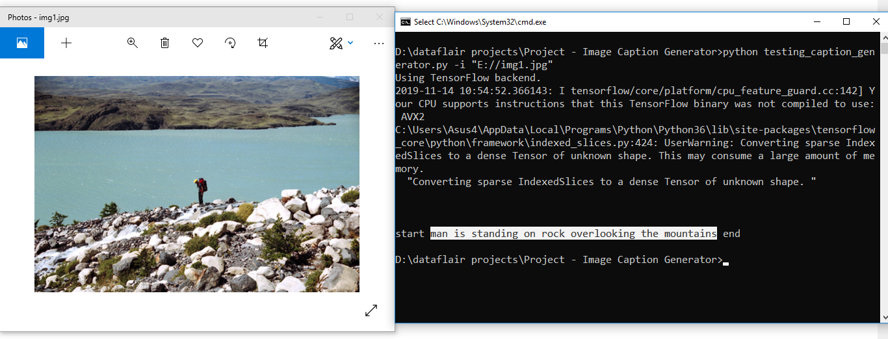
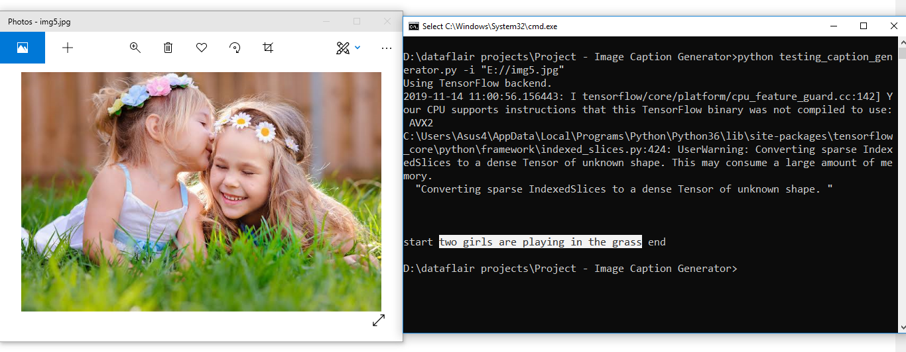

# Image-Caption-Generator-with-CNN-LSTM
In this  project, we will be implementing the caption generator using CNN (Convolutional Neural Networks) and LSTM (Long short term memory).

The Dataset of  the Project
For the image caption generator, we will be using the Flickr_8K dataset. 

direct link to download the dataset (Size: 1GB).

Flicker8k_Dataset : https://github.com/jbrownlee/Datasets/releases/download/Flickr8k/Flickr8k_Dataset.zip

Flickr_8k_text :  https://github.com/jbrownlee/Datasets/releases/download/Flickr8k/Flickr8k_text.zip

The Flickr_8k_text folder contains file Flickr8k.token which is the main file of our dataset that contains image name and their respective captions separated by newline(“\n”).

# Pre-requisites

Make sure you have installed all the following necessary libraries:

tensorflow
keras
pillow
numpy
tqdm

# Project File Structure
Downloaded from dataset:

Flicker8k_Dataset – Dataset folder which contains 8091 images.
Flickr_8k_text – Dataset folder which contains text files and captions of images.

### files of the project.

Models – It will contain our trained models.

Descriptions.txt – This text file contains all image names and their captions after preprocessing.

Features.p – Pickle object that contains an image and their feature vector extracted from the Xception pre-trained CNN model.

Tokenizer.p – Contains tokens mapped with an index value.

Model.png – Visual representation of dimensions of our project.

Testing_caption_generator.py – Python file for generating a caption of any image.

Training_caption_generator.ipynb – Jupyter notebook in which we train and build our image caption generator.

we can summery the bukiding blocks of the project into :
# Project steps

1. First, we import all the necessary packages

2. Getting and performing data cleaning

3. Extracting the feature vector from all images 

We are using the Xception model which has been trained on imagenet dataset that had 1000 different classes to classify.
Make sure you are connected to the internet as the weights get automatically downloaded. 
Since the Xception model was originally built for imagenet, we will do little changes for integrating with our model. 
One thing to notice is that the Xception model takes 299*299*3 image size as input. 
We will remove the last classification layer and get the 2048 feature vector.

4. Loading dataset for Training the model

5. Tokenizing the vocabulary 

6. Create Data generator

7. Defining the CNN-RNN model

To define the structure of the model, we will be using the Keras Model from Functional API. It will consist of three major parts:

Feature Extractor – The feature extracted from the image has a size of 2048, with a dense layer, we will reduce the dimensions to 256 nodes.
Sequence Processor – An embedding layer will handle the textual input, followed by the LSTM layer.
Decoder – By merging the output from the above two layers, we will process by the dense layer to make the final prediction. The final layer will contain the number of nodes equal to our vocabulary size.

8. Training the model

To train the model, we will be using the 6000 training images by generating the input and output sequences in batches and fitting them to the model using model.fit_generator() method.

9. Testing the model

The model has been trained, now, we will make a separate file testing_caption_generator.py which will load the model and generate predictions. 
The predictions contain the max length of index values so we will use the same tokenizer.p pickle file to get the words from their index values.

# Result

 

